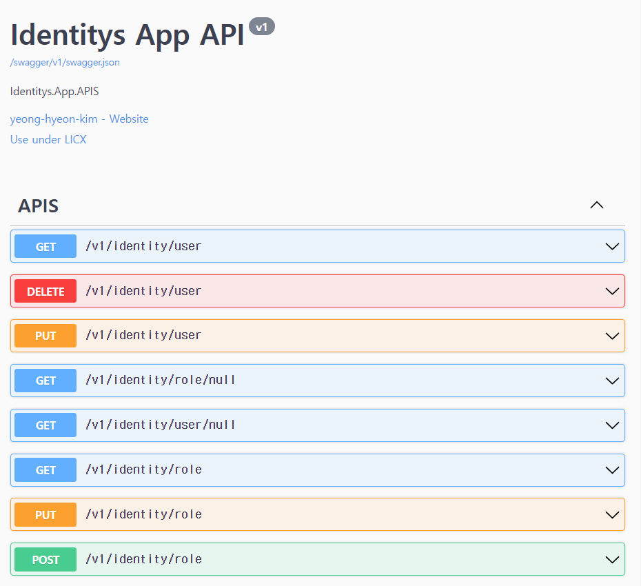

# 📕 ASP .Net Core Identitys

* `ASP.NET Core Identity Entity Framework Core`를 활용한 사용자 관리`(User Management)` 템플릿 입니다.
* 기본적으로 제공되는 `Identity Migration`을 활용하여 사용자 관리 기능을 확장합니다.
* 영문으로 작성된 `Identity` 양식을 한글화 합니다.

## 🏷️ 기능(Function)

1. 사용자(`Identity Users`)관리
   1. 사용자 등록(Registration User.)
   2. 사용자 조회(Select Users.)
   3. 사용자 업데이트(Update User information.)
   4. 사용자 제거(Delete User)
   5. 사용자 잠금 해제(Remove Account Lock.)
2. 역할(`Identity Roles`) 관리
   1. 권한 등록(Registration Roles.)
   2. 권한 조회(Select Roles.)  
   3. 권한 업데이트(Update Role.)
   4. 권한 제거(Delete Role.)

### 세부 기능(Function Detail)

#### 사용자 등록

   1. 사용자를 등록합니다.

#### 역할(권한) 조회

1. 역할(권한) 목록을 표시합니다.
2. 특정 역할(권한)의 명칭을 수정합니다.
3. 특정 역할(권한)을 삭제합니다.

#### 사용자 관리

1. 사용자별 역할(권한) 목록을 표시합니다.
2. 사용자별 역할(권한) 및 정보를 수정합니다.
3. 사용자를 삭제합니다.

#### 미승인 사용자

1. `Identity` 사용자 등록은 되어있으나 권한이 부여되지 않은 사용자 목록을 표시합니다.
2. 미승인 사용자를 삭제합니다.
3. 역할(권한)을 부여하여 승인합니다.

#### 미등록 사용자

1. `Users` 사용자 등록은 되어있으나 `Identity` 사용자 등록은 되어있지 않은 사용자 목록을 표시합니다.

#### 사용자 잠금 해제

1. ID 및 PW 오류로 계정이 잠금 상태일 경우 해제합니다.

## 💻 개발 환경(Develop Environment)

### 🧰 시스템 환경(System Environment)

||운영체제(OS)|언어(Language)|프레임워크(Framework)|종속성(Dependency)|
|-|:-:|:-:|:-:|:-:|
|명칭(Name)|||||
|버전(Version)|`10, 11 Pro`|`10.0`|`6.0`|`6.2.1.2`|

### 🌐 브라우저 지원(Browser Support)

|Chrome|Microsoft Edge|Firefox|
|:-:|:-:|:-:|
|||
|`Latest` ✔|`Latest` ✔|`Latest` ✔|

---

### 🧪 테스트(Test)

#### Swagger

* URL : <https://{Domain}:{Port}/swagger/index.html>
* VERSION : V1

* Method
  * GET
    * 사용자 조회 : [/v1/identity/user]("")
    * 권한 목록 조회 : [/v1/identity/role]("")
    * 권한이 없는 사용자 조회 : [/v1/identity/role/null]("")
  * POST
    * 권한 등록 : [/v1/identity/role]("")
  * PUT
    * 권한 수정 : [/v1/identity/role]("")
  * DELETE
    * 사용자 제거 : [/v1/identity/user]("")

## 📖 비고(Remark)

### 1. 데이터베이스 연결[Database Connection]

* 자세한 내용은 [appsettings](./App/appsettings.json)에서 확인할 수 있습니다.

#### User Database

> "APP.DB": "Server=`Server IP`, `Port`; Database=APP.DB; User Id=`Login User ID`; Password=`Login User PW`;"

#### Identity Database

> "APP.INDENTITY": "Server=`Server IP`, `Port`; Database=APP.Identity; User Id=`Login User ID`; Password=`Login User PW`;"

### 2. 데이터베이스 업데이트(구조 동기화) [Database Update(Sync Structure)]

#### Package Manage Console

User Database

> "update-database -Context `AppDbContext`"

Identity Database

> "update-database -Context `ApplicationDbContext`"

## 🔍 Identity Schema

* 자세한 내용은 [Identity](./IDENTITYS.md)에서 확인할 수 있습니다.
