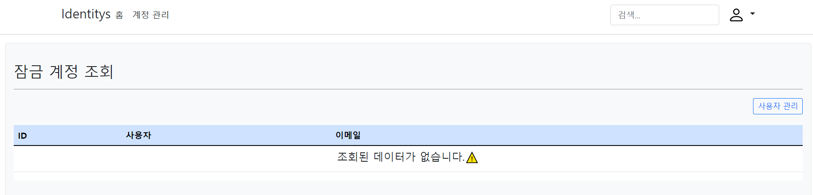

## 개요(Introduce)

## ASP Net Core Identitys
  * `ASP.NET Core Identity Entity Framework Core`를 활용한 사용자 관리`(User Management)` 예제
  * 기본적으로 제공되는 `Identity Migration`을 활용하여 사용자 관리 기능을 확장합니다.
  * 영문으로 작성된 탬플릿을 한글화 합니다.

## 기능(Function)

1. 사용자`(Identity Users)` 관리
   1. 사용자 등록
   2. 사용자 조회  
   3. 사용자 업데이트
   4. 사용자 제거
   5. 사용자 잠금 해제
2. 역할`(Identity Roles)` 관리
   1. 권한 등록
   2. 권한 조회  
   3. 권한 업데이트
   4. 권한 제거

## 세부 설명(Detail Description)

1. 사용자 등록
   1. 사용자를 등록합니다.
2. 역할(권한) 조회
   1. 역할(권한) 목록을 표시합니다.
   2. 특정 역할(권한)의 명칭을 수정합니다.
   3. 특정 역할(권한)을 삭제합니다.

    
   
   
3. 사용자 관리
   1. 사용자별 역할(권한) 목록을 표시합니다.
   2. 사용자별 역할(권한) 및 정보를 수정합니다.
   3. 사용자를 삭제합니다.

    
   
   
4. 미승인 사용자
   1. `Identity` 사용자 등록은 되어있으나 권한이 부여되지 않은 사용자 목록을 표시합니다.
   2. 미승인 사용자를 삭제합니다.
   3. 역할(권한)을 부여하여 승인합니다.

    
   
   
5. 미등록 사용자
   1. `Users` 사용자 등록은 되어있으나 `Identity` 사용자 등록은 되어있지 않은 사용자 목록을 표시합니다.
6. 사용자 잠금 해제
   1. ID 및 PW 오류로 계정이 잠금 상태일 경우 해제합니다.

    

   

## 프로젝트 빌드(Project Bulid)

### Database Connection(appsettings)
* `User Database`
> "APP.DB": "Server=`Server IP`, `Port`; Database=APP.DB; User Id=`Login User ID`; Password=`Login User PW`;"
* `Identity Database`
> "APP.INDENTITY": "Server=`Server IP`, `Port`; Database=APP.Identity; User Id=`Login User ID`; Password=`Login User PW`;"

### Database Update(Package Manage Console)
* `User Database`
> "update-database -Context `AppDbContext`"
* `Identity Database`
> "update-database -Context `ApplicationDbContext`"
