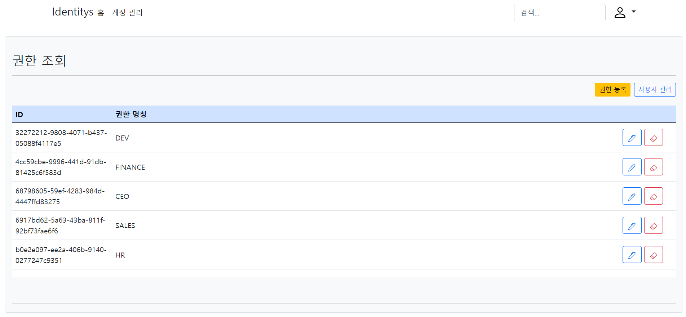

# 📕 프로젝트 개요(Introduce Project)

## ASP .Net Core Identitys

* `ASP.NET Core Identity Entity Framework Core`를 활용한 사용자 관리`(User Management)` 템플릿 입니다.
* 기본적으로 제공되는 `Identity Migration`을 활용하여 사용자 관리 기능을 확장합니다.
* 영문으로 작성된 `Identity` 양식을 한글화 합니다.

## 🏷️ 기능(Function)

1. 사용자`(Identity Users)` 관리
   1. [사용자 등록(Registration User.)](#사용자-등록)
   2. [사용자 조회(Select Users.)](#사용자-관리)
   3. 사용자 업데이트(Update User information.)
   4. 사용자 제거(Delete User)]
   5. 사용자 잠금 해제(Remove Account Lock.)
2. 역할`(Identity Roles)` 관리
   1. 권한 등록(Registration Roles.)
   2. 권한 조회(Select Roles.)  
   3. 권한 업데이트(Update Role.)
   4. 권한 제거(Delete Role.)

### 세부 기능(Function Detail)

#### 사용자 등록

   1. 사용자를 등록합니다.

#### 역할(권한) 조회

1. 역할(권한) 목록을 표시합니다.
2. 특정 역할(권한)의 명칭을 수정합니다.
3. 특정 역할(권한)을 삭제합니다.

#### 사용자 관리

1. 사용자별 역할(권한) 목록을 표시합니다.
2. 사용자별 역할(권한) 및 정보를 수정합니다.
3. 사용자를 삭제합니다.

#### 미승인 사용자

1. `Identity` 사용자 등록은 되어있으나 권한이 부여되지 않은 사용자 목록을 표시합니다.
2. 미승인 사용자를 삭제합니다.
3. 역할(권한)을 부여하여 승인합니다.

#### 미등록 사용자

1. `Users` 사용자 등록은 되어있으나 `Identity` 사용자 등록은 되어있지 않은 사용자 목록을 표시합니다.

#### 사용자 잠금 해제

1. ID 및 PW 오류로 계정이 잠금 상태일 경우 해제합니다.

## 💻 개발 환경(Develop Environment)

||운영체제(OS)|언어(Language)|프레임워크(Framework)|종속성(Dependency)|
|-|:-:|:-:|:-:|:-:|
|명칭(Name)|||||
|버전(Version)|`10, 11 Pro`|`10.0`|`6.0`|`6.2.1.2`|

---

### 🧪 테스트(Test)

#### Swagger

* URL : <https://{Domain}:{Port}/swagger/index.html>

## 📖 비고(Remark)

### 1. 데이터베이스 연결[Database Connection]

#### Ref:appsettings.json

*`User Database`
> "APP.DB": "Server=`Server IP`, `Port`; Database=APP.DB; User Id=`Login User ID`; Password=`Login User PW`;"

*`Identity Database`
> "APP.INDENTITY": "Server=`Server IP`, `Port`; Database=APP.Identity; User Id=`Login User ID`; Password=`Login User PW`;"

### 2. 데이터베이스 업데이트(구조 동기화) [Database Update(Sync Structure)]

#### Package Manage Console

* `User Database`

> "update-database -Context `AppDbContext`"

* `Identity Database`

> "update-database -Context `ApplicationDbContext`"

## 🔍 Identity Schema

### AspNetUsers

|필드(Field)|내용(Content)|
|-|-|
|AspNetUsers |테이블의 기본키|
|UserName |사용자명(기본값 : 이메일)|
|NormalizedUserName| 정규화된 사용자명|
|Email |이메일 주소|
|NormalizedEmail |정규화된 이메일 주소 정규화|
|EmailConfirmed |이메일 인증 여부|
|PasswordHash |패스워드 해시 변환 값|
|SecurityStamp |사용자 자격 증명이 변경될 때마다 변경해야 하는 임의 값(암호 변경, 로그인 제거)|
|ConcurrencyStamp |사용자가 저장소에 유지될 때마다 변경해야 하는 임의 값|
|PhoneNumber |휴대전화 번호|
|PhoneNumberConfirmed |휴대전호 번호 인증 여부|
|TwoFactorEnabled |사용자에 대해 2단계 인증이 사용되는지 여부를 나타내는 값|
|LockoutEnd |계정 잠금 유효기간|
|LockoutEnabled |사용자에 대해 계정 잠금이 사용되는지 여부를 나타내는 값|
|AccessFailedCount |현재 사용자에 대해 실패한 로그인 시도 횟수|

### AspNetRoles

|필드(Field)|내용(Content)|예시|
|-|-|-|
|Id|AspNetRoles 테이블의 기본키|
|Name|역할(권한)명|개발팀, 인사팀, 영업팀|
|NormalizedName|정규화된 역할(권한)명|

### AspNetUserRoles

|필드(Field)|내용(Content)|
|-|-|
|UserId| 사용자 Id |
|RoleId|역할(권한)명|

### AspNetUserClaims

|필드(Field)|내용(Content)|예시|
|-|-|-|
|Id|RoleClaims 기본키|
|RoleId| 역할(권한) Id|
|ClaimType| 역할 그룹명|개발팀 포지션|
|ClaimValue| 역할 그룹에 속한 요소|프론트 엔드, 벡 엔드|
