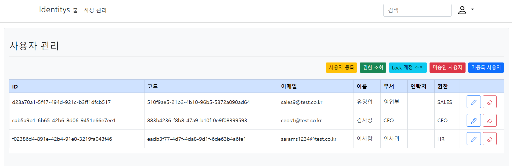

## 📕 프로젝트 개요(Introduce Project)

### ASP .Net Core Identitys
  * `ASP.NET Core Identity Entity Framework Core`를 활용한 사용자 관리`(User Management)` 템플릿 입니다.
  * 기본적으로 제공되는 `Identity Migration`을 활용하여 사용자 관리 기능을 확장합니다.
  * 영문으로 작성된 `Identity` 탬플릿을 한글화 합니다.

## 🏷️ 기능(Function)

1. 사용자`(Identity Users)` 관리
   1. [사용자 등록(Registration User.)](#사용자-등록)
   2. [사용자 조회(Select Users.)](#사용자-관리)
   3. 사용자 업데이트(Update User information.)
   4. 사용자 제거(Delete User)]
   5. 사용자 잠금 해제(Remove Account Lock.)
2. 역할`(Identity Roles)` 관리
   1. 권한 등록(Registration Roles.)
   2. 권한 조회(Select Roles.)  
   3. 권한 업데이트(Update Role.)
   4. 권한 제거(Delete Role.)

### 세부 기능(Function Detail)

#### 사용자 등록
   1. 사용자를 등록합니다.
#### 역할(권한) 조회
   1. 역할(권한) 목록을 표시합니다.
   2. 특정 역할(권한)의 명칭을 수정합니다.
   3. 특정 역할(권한)을 삭제합니다.
   
   
#### 사용자 관리
   1. 사용자별 역할(권한) 목록을 표시합니다.
   2. 사용자별 역할(권한) 및 정보를 수정합니다.
   3. 사용자를 삭제합니다.

   
#### 미승인 사용자
   1. `Identity` 사용자 등록은 되어있으나 권한이 부여되지 않은 사용자 목록을 표시합니다.
   2. 미승인 사용자를 삭제합니다.
   3. 역할(권한)을 부여하여 승인합니다.

   
#### 미등록 사용자
   1. `Users` 사용자 등록은 되어있으나 `Identity` 사용자 등록은 되어있지 않은 사용자 목록을 표시합니다.
#### 사용자 잠금 해제
   1. ID 및 PW 오류로 계정이 잠금 상태일 경우 해제합니다.

   

## 💻 개발 환경(Develop Environment)

* ✔ `OS` : `Microsoft Windows` 
  * 🕒 Version : ` 10 Pro 21H2`
  * 🕒 Version : ` 11 Pro 21H2`
* ✔ `Framework` : `.NET Core`, `Entity Framework Core`
  * 🕒 Version : `.NET 6`
* ✔ `Database` : `SQL Server`
  * 🕒 Version : `2019`
* ✔ `IDE` : `Visual Studio`
  * 🕒 Version : `2022`

### 🧪 테스트(Test)
#### Swagger
* URL : <https://{Domain}:{Port}/swagger/index.html>

## 📖 비고(Remark)

### 1. 데이터베이스 연결[Database Connection]

#### Ref:appsettings.json

* `User Database`
> "APP.DB": "Server=`Server IP`, `Port`; Database=APP.DB; User Id=`Login User ID`; Password=`Login User PW`;"
* `Identity Database`
> "APP.INDENTITY": "Server=`Server IP`, `Port`; Database=APP.Identity; User Id=`Login User ID`; Password=`Login User PW`;"

### 2. 데이터베이스 업데이트(구조 동기화) [Database Update(Sync Structure)]

#### Package Manage Console
* `User Database`
> "update-database -Context `AppDbContext`"
* `Identity Database`
> "update-database -Context `ApplicationDbContext`"
